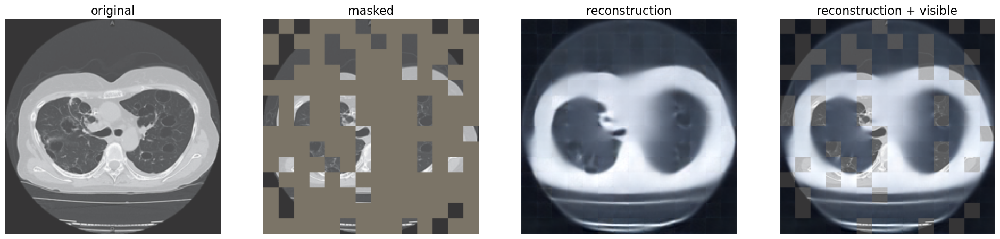
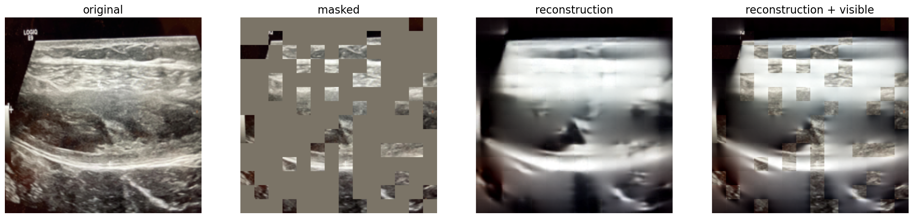
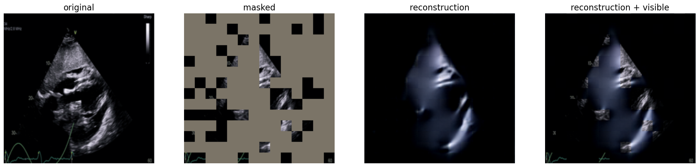
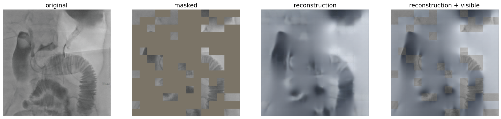
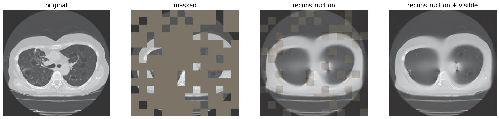
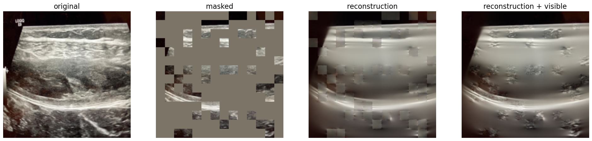
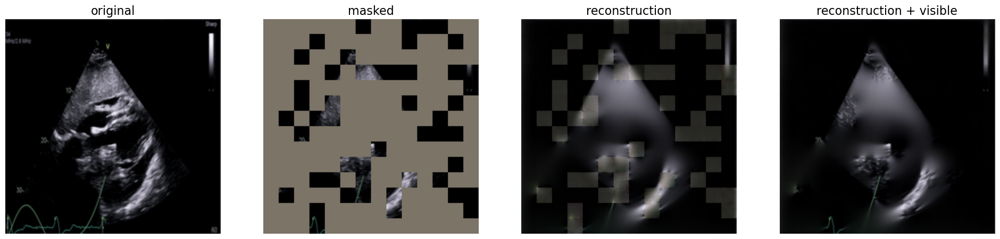
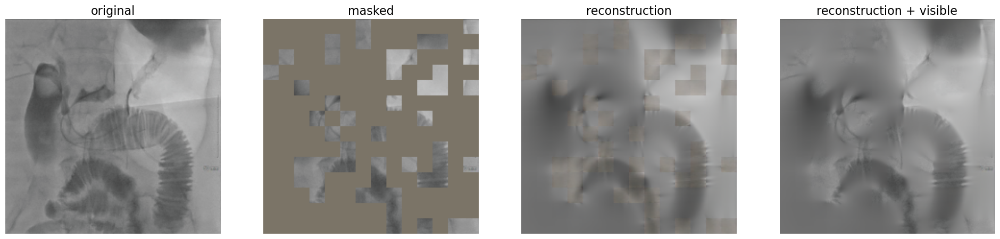

# Bone Fracture Detection Using X-Rays

## Disclaimer

This project was conducted **solely for learning purposes** and as part of an exploratory study in applying machine learning techniques to medical imaging. Due to **hardware limitations**, the model was trained with a **reduced number of epochs**, and the dataset was processed with limited computational resources. The results presented here are not optimized for real-world clinical applications and are intended only for educational demonstration.

## Overview

This project presents a machine learning pipeline for detecting bone fractures in X-ray images. The approach leverages the **facebook/vit-mae-base** model from Hugging Face for image reconstruction and classification.

- **Stage 1:** Evaluate the pretrained model's image reconstruction capability using default weights.
- **Stage 2:** Fine-tune the model on the dataset for both image reconstruction and classification.
- **Stage 3:** Add a classification head to the fine-tuned model for classifying fractured vs. non-fractured bones.

---

## Dataset Description

The dataset, sourced from [Kaggle](https://www.kaggle.com), contains **9,463 X-ray images** divided into two classes:

- **Fractured (Damaged):** Bones with visible fractures.
- **Non-Fractured (Healthy):** Bones without fractures.

### Dataset Split

- **Training Set:**
  - Non-Fractured: 4,480 images
  - Fractured: 4,383 images
- **Validation Set:**
  - Non-Fractured: 360 images
  - Fractured: 240 images

---

## Methodology

### 1. Image Reconstruction with Masked Autoencoder

- **Model Used:** [facebook/vit-mae-base](https://huggingface.co/facebook/vit-mae-base)
- **Process:**

  - The pretrained model is used **without training or fine-tuning** to reconstruct partially masked images.
  - **Masking Strategy:** 75% of the input image is masked, leaving only 25% visible.
  - The pretrained model reconstructs the missing 75% using its learned visual representations.

- **Purpose:** To evaluate the pretrained model's out-of-the-box ability to reconstruct masked images and assess its feature representation for the X-ray domain.

---

### 2. Fine-Tuning with the Dataset

- After evaluating the pretrained model, fine-tuning is performed on the labeled dataset:
  - **Masking and Reconstruction:**
    - 75% of each input image is masked during training.
    - The model learns to reconstruct the masked regions using domain-specific features.
  - **Optimization Details:**
    - **Optimizer:**
      ```python
      optimizer = torch.optim.Adam(model.parameters(), lr=1e-4)
      ```
    - **Loss Function:** Mean Squared Error (MSE) Loss for image reconstruction.
      ```python
      criterion = torch.nn.MSELoss()
      ```
    - **Training Epochs:** 10 epochs, performed in multiple sessions due to **hardware limitations**.

---

# Image Reconstruction Results

## Reconstruction Using Default Weights

Below are the reconstruction results using the **default weights** of the pretrained model.

### Example Results

| Original                                       | Masked                                         | Reconstruction                                 | Reconstruction + Visible                       |
| ---------------------------------------------- | ---------------------------------------------- | ---------------------------------------------- | ---------------------------------------------- |
|  |  |  |  |

---

## Reconstruction Using Fine-Tuned Weights

Below are the reconstruction results using the **fine-tuned weights** of the model.

### Example Results

| Original                                       | Masked                                         | Reconstruction                                 | Reconstruction + Visible                       |
| ---------------------------------------------- | ---------------------------------------------- | ---------------------------------------------- | ---------------------------------------------- |
|  |  |  |  |

---

## Observations

- The **default weights** provide a baseline for reconstruction, focusing on general image structure.
- The **fine-tuned weights** improve reconstruction quality by learning domain-specific features from the dataset.

---

### 3. Classification of Fractured vs. Non-Fractured Bones

- A **classification head** is added to the feature extractor of the fine-tuned model.
- The classification head predicts one of two classes:
  - **Fractured Bones**
  - **Non-Fractured Bones**
- This stage utilizes the fine-tuned model's domain-specific feature representations for accurate classification.

---

# Model Evaluation: Confusion Matrices and Classification Reports

## Confusion Matrices

### Training Set Confusion Matrix

The following confusion matrix represents the model's performance on the **training set**:


---

### Validation Set Confusion Matrix

The following confusion matrix represents the model's performance on the **validation set**:


---

## Classification Reports

### Training Set Classification Report

| Metric        | Not Fractured | Fractured | Macro Avg | Weighted Avg |
| ------------- | ------------- | --------- | --------- | ------------ |
| **Precision** | 0.9844        | 0.9595    | 0.9720    | 0.9721       |
| **Recall**    | 0.9594        | 0.9845    | 0.9719    | 0.9718       |
| **F1-Score**  | 0.9717        | 0.9718    | 0.9718    | 0.9718       |
| **Support**   | 4480          | 4383      |           | 8863         |

- **Overall Accuracy:** 0.9718
- The training set results demonstrate high precision, recall, and F1-score for both classes, indicating strong performance during training.

---

### Validation Set Classification Report

| Metric        | Not Fractured | Fractured | Macro Avg | Weighted Avg |
| ------------- | ------------- | --------- | --------- | ------------ |
| **Precision** | 0.6687        | 0.7130    | 0.6908    | 0.6864       |
| **Recall**    | 0.9139        | 0.3208    | 0.6174    | 0.6767       |
| **F1-Score**  | 0.7723        | 0.4425    | 0.6074    | 0.6404       |
| **Support**   | 360           | 240       |           | 600          |

- **Overall Accuracy:** 0.6767
- Validation set results show a significant drop in recall for the fractured class, resulting in a lower F1-score for that class.

---

## Observations

### Training Set

- **High Performance:** Both classes exhibit high precision, recall, and F1-scores, indicating the model effectively captures the relationships in the training data.
- **Balanced Performance:** Precision and recall are balanced for both fractured and non-fractured classes.

### Validation Set

- **Performance Gap:** The model shows a noticeable performance drop on the validation set, particularly for the fractured class.
  - **Recall for Fractured:** Only 32.08%, indicating the model misses many fractured cases.
  - **Precision for Non-Fractured:** High at 66.87%, suggesting the model is better at detecting non-fractured bones.
- **F1-Score:** The overall F1-score of 0.6404 reflects the imbalance in recall for the fractured class.

---

## Suggestions for Improvement

1. **Class Imbalance Handling:**

   - Apply a **weighted loss function** to penalize misclassification of the fractured class more heavily.
   - Use **oversampling** or **data augmentation** for fractured cases during training.

2. **Threshold Adjustment:**

   - Experiment with different classification thresholds to balance precision and recall for the fractured class.

3. **Regularization and Fine-Tuning:**

   - Apply regularization techniques and adjust hyperparameters to reduce overfitting to the training set.

4. **Cross-Validation:**
   - Perform cross-validation to ensure better generalization and consistent performance across all validation splits.

---

## Summary Metrics

### Training Set

- **Accuracy:** 0.9718
- **Precision:** 0.9721
- **Recall:** 0.9718
- **F1-Score:** 0.9718

### Validation Set

- **Accuracy:** 0.6767
- **Precision:** 0.6864
- **Recall:** 0.6767
- **F1-Score:** 0.6404

---

These insights provide a comprehensive understanding of the model's strengths and areas for improvement, guiding future iterations of training and fine-tuning.

## Model and Tools

- **Model Backbone:** [facebook/vit-mae-base](https://huggingface.co/facebook/vit-mae-base)
  - Used for both reconstruction and feature extraction during fine-tuning.
- **Loss Function:**
  - Reconstruction: Mean Squared Error (MSE) Loss
  - Classification: To be specified based on task requirements (e.g., Cross-Entropy Loss).
- **Optimizer:** Adam optimizer with a learning rate of `1e-4`.
- **Libraries and Frameworks:**
  - PyTorch for model implementation and training.
  - Hugging Face Transformers for pretrained model integration.
  - OpenCV for image preprocessing.
  - NumPy and Pandas for data handling.

---

## Results and Evaluation

### Image Reconstruction

- **Initial Evaluation:** The pretrained model’s reconstruction quality is evaluated visually to assess how well it recovers masked parts.
- **Fine-Tuned Evaluation:** After fine-tuning, the model's ability to reconstruct domain-specific images is reassessed.

### Classification

- The fine-tuned model’s classification performance is validated using the validation set.
- Evaluation Metrics:
  - **Accuracy**
  - **Precision**
  - **Recall**
  - **F1-Score**

---

## Limitations and Challenges

- **Hardware Constraints:** Training was conducted in multiple sessions due to limited computational resources.
- **Dataset Imbalance:** Slight class imbalance may influence the model's performance.

---

## Future Work

- **Experimentation with Architectures:** Explore other Vision Transformer models for better performance.
- **Augmentation Techniques:** Use advanced data augmentation strategies to improve generalization.
- **Extended Training:** Conduct more extensive training with improved hardware.

---

## Citation and Acknowledgments

- **Pretrained Model:** [facebook/vit-mae-base](https://huggingface.co/facebook/vit-mae-base)
- **Dataset:** [Kaggle](https://www.kaggle.com)

For further questions or suggestions, feel free to open an issue in this repository.
